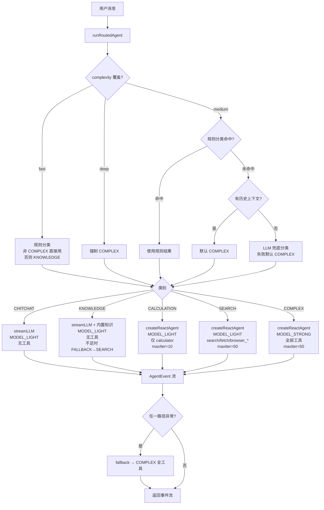
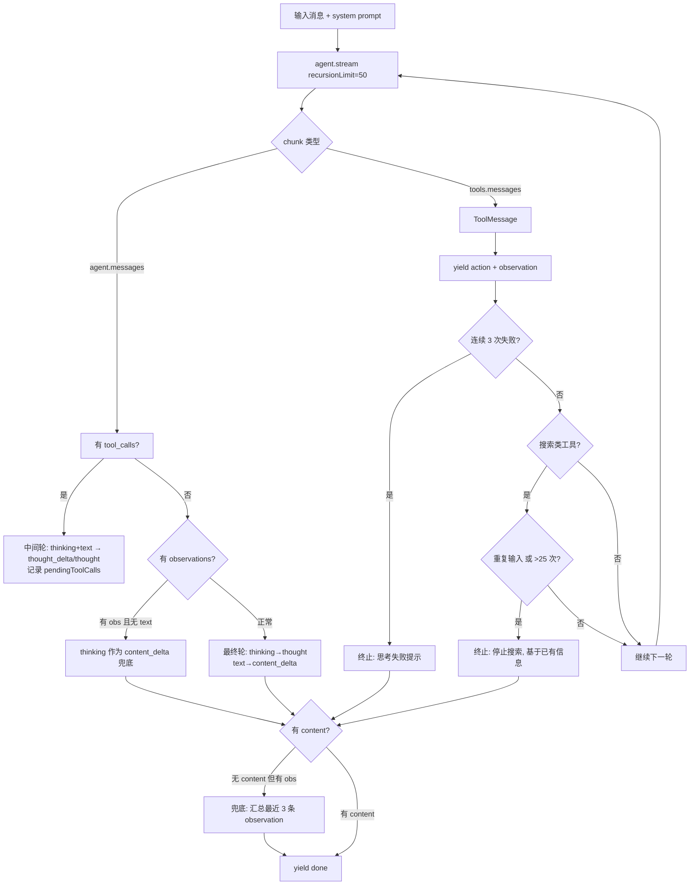
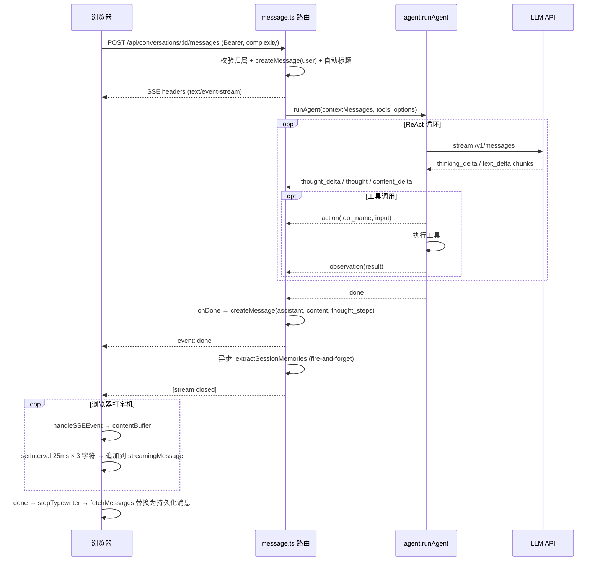
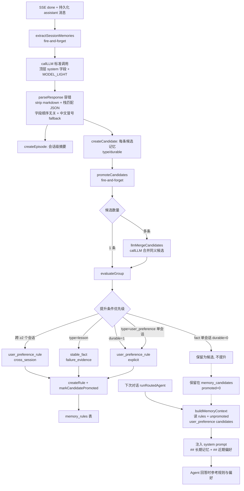
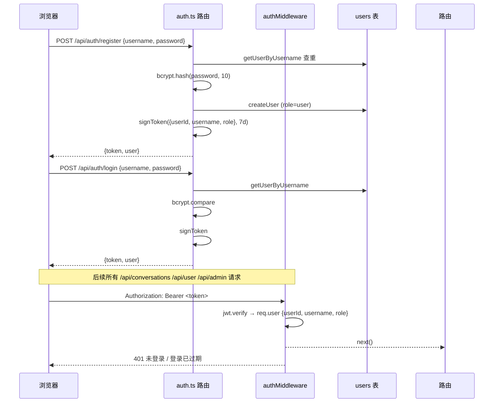
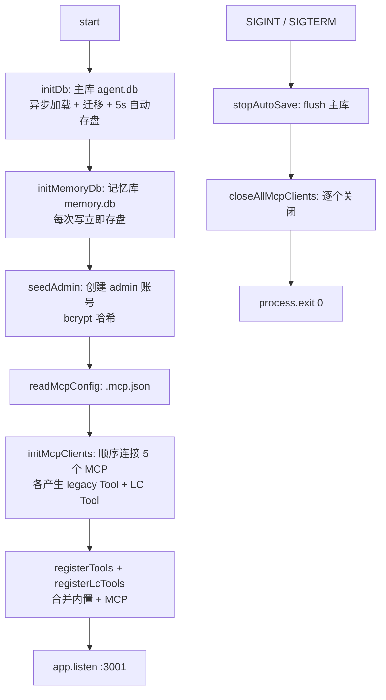

# ReAct Agent Chat

基于 **ReAct (Reasoning + Acting)** 模式的 AI Agent 聊天应用。Vue 3 前端 + Express 后端，支持**查询分类路由**、多模型调度、长期记忆、思考过程可视化、消息分支、MCP 动态工具加载、流式打字机输出、用户认证与多租户隔离。

## 功能特性

- **查询分类路由** - 规则 + LLM 兜底，将查询分流到 5 条路径（CHITCHAT/KNOWLEDGE/CALCULATION/SEARCH/COMPLEX），按路径选模型、过滤工具
- **多模型调度** - 轻量模型（`deepseek-v4-flash`）处理简单路径，强模型（`glm-5.2`）处理复杂路径
- **复杂度覆盖** - 前端 `fast/medium/deep` 三档覆盖分类结果，`fast` 强制轻量、`deep` 强制 COMPLEX
- **长期记忆系统** - 会话级 Episode 提取 → Candidate 候选 → 规则提升（跨会话/失败教训/显式标记）→ Rule 注入下次对话 system prompt
- **内置知识库** - 节假日日期、动态当前日期、常识性信息，避免无意义联网搜索
- **ReAct 智能对话** - LangGraph `createReactAgent` 驱动的思考→行动→观察循环，支持多轮工具调用
- **多对话管理** - 创建/切换/删除/置顶（每人最多 5 个）、System Prompt 自定义
- **思考过程可视化** - 实时展示 Agent 推理步骤，可折叠查看
- **消息分支** - 编辑任意消息生成分支，`parent_id` 构成树结构，支持分支导航切换
- **流式输出** - SSE 打字机效果，实时流式返回 Agent 回复
- **MCP 工具扩展** - 通过 `.mcp.json` 动态加载外部工具，stdio / SSE 两种传输
- **内置工具** - 网页搜索（Bing）、虚拟文件系统、高等数学计算器
- **用户认证与多租户** - JWT 登录、bcrypt 密码、admin/user 角色、对话归属隔离、孤儿对话认领
- **个人设置** - 头像上传、主题（light/dark/auto）、字号、修改密码
- **管理后台** - admin 角色可查看所有用户与其对话历史
- **对话导出** - 支持 JSON / Markdown 格式导出
- **事实核查** - Agent 回答完成后后置校验是否编造（仅记日志，不阻断）
- **暗色主题** - Ethereal Glass 全局暗色设计风格

## 技术栈

| 层级 | 技术 | 版本 | 用途 |
|------|------|------|------|
| 前端框架 | Vue 3 + TypeScript | ^3.5.0 | SFC + `<script setup>` |
| 状态管理 | Pinia | ^2.2.0 | auth / conversation / message |
| 路由 | Vue Router | ^4.6.4 | `/login` + `/` 守卫 |
| 构建工具 | Vite | ^6.0.0 | dev server + API 代理 |
| UI 方案 | Tailwind CSS | ^3.4.0 | 暗色主题 |
| Markdown | marked + highlight.js | ^18 / ^11 | 消息渲染 + 代码高亮 |
| 后端 | Node.js + Express | ^4.21.0 | REST + SSE |
| 数据库 | sql.js (WASM SQLite) | ^1.11.0 | 主库 + 记忆库双库 |
| LLM 编排 | LangChain + LangGraph | ^1.4.x | `createReactAgent` ReAct 循环 |
| LLM 接入 | Anthropic 兼容 API | - | 仅 `stream:true` |
| MCP 客户端 | @modelcontextprotocol/sdk | ^1.29.0 | 动态工具发现 |
| 认证 | jsonwebtoken + bcryptjs | ^9 / ^3 | JWT 7d + 密码哈希 |
| 文件上传 | multer | ^2.2.0 | 头像上传 |
| 数学计算 | mathjs + nerdamer | ^15 / ^1.1 | 计算器工具 |
| 网页解析 | cheerio | ^1.0.0 | search 工具 HTML 提取 |
| Schema | zod | ^4.4.3 | MCP 工具入参校验 |
| 测试 | Vitest | ^4.1.8 | TDD 特征测试 |
| 运行时 | tsx | ^4.19.0 | 服务端 TS 执行 |

## 系统架构

整体分层架构（自上而下）：

```
┌─────────────────────────────────────────────────────────────────┐
│                        浏览器 (Vue 3 SPA)                         │
│  LoginPage ──┐                                                  │
│              │  vue-router 守卫 ──> ChatPage                     │
│  ChatPage ───┤  ├─ ConversationList (侧边栏 / 置顶 / 删除)        │
│              │  ├─ ChatArea (消息流 / 复杂度 / System Prompt)     │
│              │  ├─ ChatInput (输入框 / loading)                  │
│              │  ├─ MessageBubble (气泡 / 思考折叠 / 分支导航)      │
│              │  └─ AdminSidebar / SettingsDialog / ProfileDialog │
│  Pinia: auth │ conversation │ message                            │
│  authFetch: 自动注入 Bearer Token, 401 自动登出                   │
└──────────────────────────────┬──────────────────────────────────┘
                               │ HTTP / SSE  (Vite 代理 → :3001)
┌──────────────────────────────┴──────────────────────────────────┐
│                     Express 后端 (PORT 3001)                      │
│                                                                   │
│  Middleware:  cors → express.json → authMiddleware(JWT)           │
│  Routes:      /api/auth  /api/user  /api/admin                   │
│               /api/conversations  (conversation + message 子路由) │
│               /api/mcp/status  /avatars (静态)                    │
└──────────────────────────────┬──────────────────────────────────┘
                               │
┌──────────────────────────────┴──────────────────────────────────┐
│                       服务层 (services/)                          │
│                                                                   │
│  message.ts ──> agent.runAgent()                                  │
│                   ├─ USE_LANGCHAIN?                               │
│                   │   ├─ true  → query-router.runRoutedAgent()    │
│                   │   │            ├─ classifyQuery (规则+LLM)    │
│                   │   │            ├─ filterTools (白名单)        │
│                   │   │            └─ 5 路径分发 (见下文)          │
│                   │   └─ false → runAgentLegacy (ReAct prompt)    │
│                   ├─ langchain-adapter.langchainAgentRunner()     │
│                   │     (LangGraph stream → AgentEvent)           │
│                   ├─ llm-caller.streamLLM / callLLM               │
│                   ├─ knowledge.buildDateContext / buildKnowledge  │
│                   ├─ memory-recall.buildMemoryContext             │
│                   ├─ memory-extractor (SSE 后异步提取)            │
│                   ├─ memory-promoter (候选 → 规则提升)            │
│                   └─ validateAnswer (后置事实核查, log-only)       │
└──────────────────────────────┬──────────────────────────────────┘
                               │
┌──────────────────────────────┴──────────────────────────────────┐
│                    数据 / 工具层                                  │
│                                                                   │
│  主库 agent.db:   conversations / messages / users / schema_v    │
│  记忆库 memory.db: memory_episodes / memory_candidates / rules   │
│  内置工具: search / filesystem_* / calculator                    │
│  MCP 工具: playwright / fetch / filesystem / sqlite / amap-maps  │
└──────────────────────────────────────────────────────────────────┘
```

## 快速开始

### 环境要求

- Node.js >= 18
- npm >= 9
- Python + [uvx](https://docs.astral.sh/uv/)（仅当 MCP 配置使用 uvx 服务时）
- npx（随 Node.js 安装）

### 安装依赖

```bash
# 根目录（测试依赖）
npm install

# 前端
cd client && npm install

# 后端
cd server && npm install
```

### 配置环境变量

在 `server/` 目录下创建 `.env` 文件：

```env
# LLM 接入
ANTHROPIC_AUTH_TOKEN=your-api-key
ANTHROPIC_BASE_URL=https://api.anthropic.com
AGENT_MODEL_LIGHT=deepseek-v4-flash
AGENT_MODEL_STRONG=glm-5.2

# 认证
JWT_SECRET=your-jwt-secret
ADMIN_USERNAME=admin
ADMIN_PASSWORD=your-admin-password

# 服务
PORT=3001
DB_PATH=server/data/agent.db
MEMORY_DB_PATH=server/data/memory.db
MCP_CONFIG_PATH=.mcp.json

# Agent 实现
USE_LANGCHAIN=true
```

### 启动开发服务

```bash
# 启动后端（端口 3001，MCP 初始化需 15-20 秒）
cd server && npm run dev

# 启动前端（端口 5173，已开启局域网访问）
cd client && npm run dev
```

访问 http://localhost:5173，使用 admin 账号或注册新账号登录。

### 运行测试

```bash
# 全部测试（项目根目录）
npm run test

# 单个测试模块
npx vitest run test/server/services/query-router.test.ts

# 监听模式
npm run test:watch
```

## 项目结构

```
agent/
├── .mcp.json                         # MCP 服务器配置（5 个服务）
├── CLAUDE.md                         # Claude Code 开发指引
├── SPEC.md                           # 项目规格说明书
├── vitest.config.ts                  # 测试配置
├── package.json                      # 根级测试依赖
│
├── client/                           # Vue 3 前端 (ESM)
│   ├── vite.config.ts                # dev server + /api 代理到 :3001
│   ├── tailwind.config.ts            # 暗色主题色值
│   └── src/
│       ├── main.ts                   # createApp + Pinia + router
│       ├── App.vue                   # <router-view> 根组件
│       ├── router/index.ts           # /login + / 路由 + 认证守卫
│       ├── types/index.ts            # User/Conversation/Message/AgentEvent/Complexity
│       ├── assets/main.css           # 全局样式 + 打字机动画
│       ├── views/
│       │   ├── LoginPage.vue         # 登录/注册页
│       │   └── ChatPage.vue          # 主聊天页（侧边栏 + ChatArea）
│       ├── components/
│       │   ├── ChatArea.vue          # 消息流 + 复杂度选择 + System Prompt 弹窗
│       │   ├── ChatInput.vue         # 输入框 + loading spinner + 复杂度
│       │   ├── ConversationList.vue  # 对话列表 + 置顶 + 删除确认
│       │   ├── MessageBubble.vue     # 消息气泡 + 思考折叠 + 复制 + 分支
│       │   ├── ThoughtStep.vue       # 单个思考步骤渲染
│       │   ├── BranchNavigator.vue   # 分支切换 < 1/3 >
│       │   ├── AdminSidebar.vue      # 管理员侧边栏（用户列表）
│       │   ├── SettingsDialog.vue    # 主题/字号设置
│       │   ├── ProfileDialog.vue     # 个人资料 + 头像 + 改密
│       │   └── SidebarFooter.vue     # 侧边栏底部入口
│       ├── stores/
│       │   ├── auth.ts               # JWT 登录/注册/me/设置/头像
│       │   ├── conversation.ts       # 对话 CRUD + 置顶 + 归属
│       │   └── message.ts            # 消息管理 + SSE 解析 + 打字机
│       ├── composables/
│       │   ├── useKeyboard.ts        # 快捷键 (Ctrl+N / Ctrl+B)
│       │   ├── useTheme.ts           # 主题应用
│       │   └── useAvatar.ts          # 头像处理
│       ├── utils/fetch.ts            # authFetch: 注入 Bearer + 401 登出
│       └── tools/codeRunner.ts       # 浏览器端代码沙箱
│
├── server/                           # Express 后端 (ESM)
│   └── src/
│       ├── index.ts                  # 入口: initDb → initMemoryDb → seedAdmin → MCP → listen
│       ├── types.ts                  # Conversation/Message/User/Tool/AgentEvent
│       ├── db/
│       │   ├── index.ts              # 主库 agent.db: 异步初始化 + 迁移 + 5s 自动存盘
│       │   ├── migrations.ts         # 主库建表 (v1-v8)
│       │   ├── memory-db.ts          # 记忆库 memory.db: episode/candidate/rule CRUD
│       │   ├── migrations-memory.ts  # 记忆库建表
│       │   └── user.ts               # users CRUD + seedAdmin
│       ├── middleware/auth.ts        # JWT 校验 + adminMiddleware + signToken
│       ├── routes/
│       │   ├── auth.ts               # /api/auth: register/login/me
│       │   ├── user.ts               # /api/user: settings/avatar/password
│       │   ├── admin.ts              # /api/admin: users + 用户会话
│       │   ├── conversation.ts       # /api/conversations: CRUD + 置顶 + 导出
│       │   └── message.ts            # /api/conversations/:id/messages: SSE + 分支 + 重新生成
│       ├── services/
│       │   ├── agent.ts              # ReAct 入口: 切换 LangChain/Legacy + 事实核查
│       │   ├── query-router.ts       # 查询分类 + 工具过滤 + 5 路径分发
│       │   ├── langchain-adapter.ts  # LangGraph stream → AgentEvent + 停止检测
│       │   ├── llm-caller.ts         # streamLLM / callLLM 通用调用
│       │   ├── llm-config.ts         # 模型/API 共享配置（避免循环依赖）
│       │   ├── knowledge.ts          # 内置知识 + 动态日期上下文
│       │   ├── tool-adapter.ts       # 内置 Tool → DynamicStructuredTool 包装
│       │   ├── memory-extractor.ts   # 会话 → episode + candidates
│       │   ├── memory-promoter.ts    # candidates → rules（含 LLM 合并）
│       │   └── memory-recall.ts      # rules → system prompt 注入
│       ├── tools/
│       │   ├── index.ts              # 内置工具注册 + registerTools/registerLcTools
│       │   ├── search.ts             # Bing 搜索 / URL 抓取 + cheerio 提取
│       │   ├── filesystem.ts         # 虚拟工作区 + 路径穿越防护
│       │   └── calculator.ts         # mathjs + nerdamer 高等数学
│       ├── mcp/
│       │   ├── config.ts             # 读取 .mcp.json, MCP_CONFIG_PATH 覆盖
│       │   └── client.ts             # MCP SDK 客户端: stdio/sse + 工具发现 + Zod 转换
│       ├── data/                     # 运行时生成: agent.db / memory.db / avatars/
│       └── workspace/                # 虚拟文件工作区根目录
│
├── test/                             # 特征测试 (TDD)
│   ├── client/                       # 前端: components/stores/composables/tools
│   └── server/                       # 后端: services/tools/db/routes
│
└── docs/superpowers/                 # 设计文档 + 实现计划
    ├── specs/                        # YYYY-MM-DD-<topic>-design.md
    └── plans/                        # YYYY-MM-DD-<feature>.md
```

## 核心流程详解

### 1. 查询分类路由流程

`runAgent()` 入口在 `USE_LANGCHAIN=true`（默认）时调用 `runRoutedAgent()`，根据查询意图分流到 5 条路径，每条路径选择不同模型与工具子集。



**5 条路径对照表：**

| 路径 | 模型 | 工具 | 实现方式 | 最大迭代 | 典型问题 |
|------|------|------|---------|---------|---------|
| CHITCHAT | MODEL_LIGHT | 无 | `streamLLM` 单次流式 | - | "你好"、"你是谁" |
| KNOWLEDGE | MODEL_LIGHT | 无 | `streamLLM` + 内置知识，不足时回退 SEARCH | - | "2026中秋几号" |
| CALCULATION | MODEL_LIGHT | `calculator` | `createReactAgent` | 10 | "根号5加根号9" |
| SEARCH | MODEL_LIGHT | `search` `fetch` `browser_*` | `createReactAgent` | 50 | "后天世界杯赛程" |
| COMPLEX | MODEL_STRONG | 全部 | `createReactAgent` | 50 | "规划13天西藏行程" |

**工具过滤规则**（`filterTools`）：
- `null` → 返回全部工具（COMPLEX）
- `[]` → 返回空数组（CHITCHAT/KNOWLEDGE）
- `['calculator']` → 精确匹配
- `['browser_*']` → 正则前缀匹配

### 2. Agent ReAct 循环流程

`createReactAgent` 创建 LangGraph ReAct 图，`langchainAgentRunner` 流式消费 `agent.stream()` 并转换为 `AgentEvent`。



**停止条件**：
- `detectStuckPattern`：连续 3 次 observation 为 `Tool error:` / `not found` / `Request timeout` / 长度 < 20
- `checkSearchEffectiveness`：搜索类工具（search/fetch/browser_*）总调用 > 25 次，或同一 `tool:input` 重复 ≥ 2 次
- `recursionLimit`：50 super-steps（≈ 25 次实际工具调用，每轮 = 推理 + 工具执行 = 2 步）
- 兜底：工具已执行但无 answer → 汇总最近 3 条有效 observation 作为 content

### 3. SSE 流式输出流程



**SSE 事件类型：**

| 事件 | 载荷 | 说明 |
|------|------|------|
| `thought_delta` | `{content}` | 流式思考片段（追加到最后一个 thought step） |
| `thought` | `{content}` | 完整思考摘要（替换最后一个 thought step） |
| `action` | `{tool_name, content}` | 工具调用 |
| `observation` | `{content}` | 工具执行结果 |
| `content_delta` | `{content}` | 最终回答片段（打字机效果） |
| `content` | `{content}` | 完整回答内容（兜底汇总） |
| `done` | - | 循环结束 |
| `error` | `{message}` | 流异常 |

**打字机控制**：前端 `contentBuffer` 累积 `content_delta`，`setInterval` 每 25ms 取 3 字符追加到 `streamingMessage.content`；`done` 时 flush 剩余 buffer。

### 4. 长期记忆系统流程

记忆系统在 SSE 流结束后**异步触发**（fire-and-forget），不阻塞用户响应。



**三库表协同：**

| 表 | 作用 | 关键字段 |
|----|------|---------|
| `memory_episodes` | 会话级摘要 | conversation_id, summary, candidate_count |
| `memory_candidates` | 待提升的候选记忆 | type(user_preference/fact/lesson), statement, durable, promoted |
| `memory_rules` | 已提升的长期规则 | kind(user_preference_rule/project_rule/stable_fact), rule, promotion_reason, supporting_conversations |

**关键容错与提升规则（2026-07-20 修复）：**

- **提取容错**：`parseResponse` 先剥离 markdown 代码块，再用栈匹配提取第一个完整 JSON 对象（字段顺序无关），失败时 fallback 到兼容中英文冒号的文本格式 -- LLM 输出格式波动不再整体丢弃
- **标准化调用**：extractor/promoter 统一用 `llm-caller.callLLM`，`system` 作为顶层字段（修复 system-in-messages 隐患，详见设计文档 `docs/superpowers/specs/2026-07-06-memory-session-management-design.md`）
- **durable 判定**：个人习惯/长期偏好/身份信息 -> `durable=true`（即使会话主题不是偏好本身），避免"睡午觉习惯"被判为非持久
- **单会话偏好提升**：`type=user_preference` 单会话即提升为 `user_preference_rule`（`promotion_reason=explicit`），无需跨会话重复；`fact` 单会话不提升
- **recall 读 candidates**：`buildMemoryContext` 同时读 rules + unpromoted `user_preference` candidates（最近 10 条），未提升的偏好也注入 system prompt 的"## 近期偏好（待验证）"节

### 5. MCP 工具加载流程

```mermaid
flowchart TD
    A[服务启动 start] --> B[readMcpConfig: .mcp.json]
    B --> C[initMcpClients: 顺序连接每个服务]
    C --> D{传输类型}
    D -- stdio --> E[StdioClientTransport<br/>command + args + env]
    D -- sse --> F[SSEClientTransport<br/>url]
    E --> G[client.connect + listTools]
    F --> G
    G --> H[每个工具构建两份实例]
    H --> I[legacy Tool<br/>string input → JSON parse<br/>input→url/query 重映射]
    H --> J[DynamicStructuredTool<br/>jsonSchemaToZod<br/>input 字段别名 + 运行时重映射]
    I --> K[registerTools: tools[]]
    J --> L[registerLcTools: lcTools[]]
    K --> M[getMcpStatus: /api/mcp/status]
    L --> M
```

**`.mcp.json` 当前配置（5 个服务）：**

| 服务 | 传输 | 命令 | 用途 |
|------|------|------|------|
| `playwright` | stdio | `npx -y @playwright/mcp` | 浏览器自动化（JS 渲染页面） |
| `fetch` | sse | `https://mcp.api-inference.modelscope.net/.../sse` | 远程抓取 |
| `filesystem` | stdio | `npx -y @modelcontextprotocol/server-filesystem` | 本地文件系统访问 |
| `sqlite` | stdio | `uvx mcp-server-sqlite --db-path agent.db` | SQLite 查询 |
| `amap-maps` | stdio | `npx -y @amap/amap-maps-mcp-server` | 高德地图（需 API Key） |

**工具适配关键点**：代理 API 可能不支持 `tools` 参数，模型会以文本形式调用 `{"input":"..."}`。`tool-adapter.ts` 的 `wrapAllTools` 跳过已有 schema 的 MCP 工具，`mcp/client.ts` 在 Zod schema 中额外接受 `input` 别名字段并在运行时重映射到 `url`/`query`/`path` 等真实参数名。

### 6. 认证与权限流程



**权限模型：**
- `user`：仅能访问 `user_id = 自己` 或 `user_id IS NULL`（孤儿）的对话；首次访问孤儿对话时自动认领（`claimOrphan`）
- `admin`：可访问所有对话；侧边栏切换为 `AdminSidebar`，可浏览所有用户与其会话
- 置顶限制：每个用户最多 5 个置顶对话（`countPinnedConversations`）
- 管理员种子：服务启动时 `seedAdmin`，账号名 `ADMIN_USERNAME || 'admin'`，密码 `ADMIN_PASSWORD || 'Xiongam-1314'`

### 7. 服务启动与关闭流程



## API 端点

### 认证 `/api/auth`

| 方法 | 路径 | 鉴权 | 说明 |
|------|------|------|------|
| POST | /api/auth/register | - | 注册（用户名 2-20 字符，密码 ≥6 位） |
| POST | /api/auth/login | - | 登录，返回 JWT + user |
| GET | /api/auth/me | Bearer | 获取当前用户信息 |

### 用户 `/api/user`

| 方法 | 路径 | 鉴权 | 说明 |
|------|------|------|------|
| PATCH | /api/user/settings | Bearer | 更新主题/字号/头像标识 |
| POST | /api/user/avatar | Bearer | 上传头像（multer，≤2MB，存 `/avatars/<uid>.jpg`） |
| PATCH | /api/user/password | Bearer | 修改密码（校验旧密码） |

### 管理 `/api/admin`（仅 admin）

| 方法 | 路径 | 鉴权 | 说明 |
|------|------|------|------|
| GET | /api/admin/users | admin | 获取所有用户列表 |
| GET | /api/admin/users/:userId/conversations | admin | 获取指定用户的会话 |

### 对话 `/api/conversations`

| 方法 | 路径 | 鉴权 | 说明 |
|------|------|------|------|
| GET | /api/conversations | Bearer | 获取自己的 + 孤儿对话（按置顶+时间排序） |
| POST | /api/conversations | Bearer | 新建对话（可含 system_prompt） |
| GET | /api/conversations/:id | Bearer | 获取单个对话（孤儿自动认领） |
| PATCH | /api/conversations/:id | Bearer | 更新标题/system_prompt/is_pinned（置顶上限 5） |
| DELETE | /api/conversations/:id | Bearer | 删除对话（级联删消息） |
| GET | /api/conversations/:id/export | Bearer | 导出（`?format=json\|md`） |

### 消息 `/api/conversations/:id/messages`

| 方法 | 路径 | 鉴权 | 说明 |
|------|------|------|------|
| GET | /:conversationId/messages | Bearer | 获取消息列表 |
| POST | /:conversationId/messages | Bearer | 发送消息（SSE 流式，含 `complexity` 参数） |
| PATCH | /:conversationId/messages/:messageId | Bearer | 编辑消息（创建分支，新 user 消息） |
| POST | /:conversationId/messages/:messageId/regenerate | Bearer | 重新生成（SSE，基于原消息之前的历史） |

### 其他

| 方法 | 路径 | 说明 |
|------|------|------|
| GET | /api/mcp/status | MCP 服务器连接状态 + 工具数 |
| GET | /avatars/<file> | 头像静态资源 |

## 数据模型与数据库

引擎为 **sql.js（WASM SQLite）**，异步初始化，所有 db 操作必须 `await`。主库每 5 秒自动存盘（dirty 标记），记忆库每次写立即存盘。

### 主库 `agent.db`（`DB_PATH`）

| 表 | 关键字段 | 说明 |
|----|---------|------|
| `conversations` | id, title, system_prompt, user_id, is_pinned, created_at, updated_at | 对话；user_id NULL 为孤儿 |
| `messages` | id, conversation_id, parent_id, role, content, thought_steps(JSON), created_at | 消息；parent_id 构成分支树 |
| `users` | id, username, password_hash, role, avatar, theme, font_size, created_at | 用户 |
| `schema_version` | version, name, applied_at | 迁移版本追踪 |

迁移（`migrations.ts`，v1-v8）：建表 → 索引 → users 表 → conversations 加 user_id/is_pinned。**只 ADD COLUMN / CREATE TABLE IF NOT EXISTS，禁止 DROP**。

### 记忆库 `memory.db`（`MEMORY_DB_PATH`）

| 表 | 关键字段 | 说明 |
|----|---------|------|
| `memory_episodes` | id, conversation_id, summary, candidate_count, created_at | 会话级摘要 |
| `memory_candidates` | id(`convId#index`), conversation_id, type, statement, durable, promoted, created_at | 候选记忆 |
| `memory_rules` | id(`rule_N`), kind, rule, promotion_reason, supporting_conversations(JSON), created_at, updated_at | 已提升规则 |

## 环境变量

| 变量 | 默认值 | 必需 | 说明 |
|------|--------|------|------|
| ANTHROPIC_AUTH_TOKEN | - | ✅ | API 密钥（兼容 `ANTHROPIC_API_KEY`） |
| ANTHROPIC_BASE_URL | https://api.anthropic.com | ✅ | API 代理地址 |
| AGENT_MODEL_LIGHT | deepseek-v4-flash | ❌ | 轻量模型（CHITCHAT/KNOWLEDGE/CALCULATION/SEARCH + 分类器） |
| AGENT_MODEL_STRONG | glm-5.2 | ❌ | 强模型（COMPLEX 路径） |
| AGENT_MODEL | = AGENT_MODEL_LIGHT | ❌ | 向后兼容统一模型 |
| JWT_SECRET | agent-chat-dev-secret-change-in-prod | ✅ | JWT 签名密钥 |
| ADMIN_USERNAME | admin | ❌ | 管理员账号名 |
| ADMIN_PASSWORD | Xiongam-1314 | ✅ | 管理员初始密码 |
| PORT | 3001 | ❌ | 后端端口 |
| DB_PATH | server/data/agent.db | ❌ | 主库路径 |
| MEMORY_DB_PATH | server/data/memory.db | ❌ | 记忆库路径 |
| MCP_CONFIG_PATH | .mcp.json | ❌ | MCP 配置文件路径 |
| WORKSPACE_ROOT | server/src/workspace | ❌ | 虚拟文件系统根目录 |
| USE_LANGCHAIN | true | ❌ | `false` 回退 Legacy ReAct 实现 |

## 内置工具

| 工具名 | 输入格式 | 说明 |
|--------|---------|------|
| search | URL 或搜索关键词 | Bing 搜索 / URL 抓取，cheerio 提取纯文本，4000 字截断，15s 超时 |
| filesystem_read | 相对路径 | 读取虚拟工作区文件 |
| filesystem_write | JSON `{path, content}` | 写入虚拟工作区文件 |
| filesystem_list | 相对目录路径 | 列出目录内容 |
| filesystem_delete | 相对路径 | 删除文件/目录 |
| calculator | JSON `{expression}` | 高等数学：四则/三角/对数/矩阵/求导/积分/方程求解（mathjs + nerdamer） |

MCP 工具在服务启动时动态发现并注册，与内置工具并存。`calculator` 以原生 `DynamicStructuredTool` 注册（跳过 adapter 包装），其余内置工具由 `wrapCustomTool` 包装为 `{input: string}` schema。

## 设计决策与已知陷阱

1. **代理 API 只支持 `stream:true`** - 非流式请求返回 500；`streamLLM`/`callLLM` 均走流式或非流式两套实现
2. **查询路由优先规则** - 规则零延迟零成本，覆盖不到的用 LLM 兜底，仍失败默认 COMPLEX（保守不丢能力）
3. **complexity 覆盖分类** - `fast` 强制轻量路径、`deep` 强制 COMPLEX、`medium` 走分类，前端三档选择器直接接通
4. **KNOWLEDGE 回退** - 内置知识不足时输出 `__FALLBACK_TO_SEARCH__` 信号，路由层检测后切换到 SEARCH 路径
5. **LangGraph recursionLimit** - 50 super-steps ≈ 25 次实际工具调用（每轮 = 推理 + 工具 = 2 步）
6. **搜索死循环防护** - 同一 `tool:input` 重复 ≥ 2 次立即终止；搜索类工具总调用 > 25 次终止
7. **事实核查 log-only** - `validateAnswer` 检查回答是否编造，但因 Agent 会用内置知识（不在 observations 中），校验失败只记日志不覆盖回答
8. **记忆异步提取 + 标准化调用** - SSE 流结束后 `extractSessionMemories` 与 `promoteCandidates` 均 fire-and-forget；extractor/promoter 统一用 `llm-caller.callLLM`（顶层 `system` 字段，修复 system-in-messages 隐患），`parseResponse` 剥离 markdown + 栈匹配 JSON + 中文冒号 fallback 容错
9. **记忆提升优先级 + recall 双源** - cross_session（≥2 会话）-> failure_evidence（lesson）-> explicit（durable=1 或 user_preference 单会话）；`fact` 单会话不提升；`buildMemoryContext` 读 rules + unpromoted `user_preference` candidates（最近 10 条），未提升偏好注入"## 近期偏好（待验证）"节
10. **MCP input 重映射** - 代理 API 可能不支持 `tools` 参数，模型以 `{"input":"..."}` 调用；Zod schema 额外接受 `input` 别名，运行时重映射到 `url`/`query`/`path`
11. **sql.js 异步** - 所有 db 操作必须 await；主库 5s 自动存盘，记忆库每次写立即存盘
12. **ESM `__dirname`** - 用 `fileURLToPath(import.meta.url)` 替代
13. **Windows child_process** - spawn 需要完整路径，npx 可能需 `.cmd` 后缀
14. **MCP 启动慢** - uvx/npx 服务需 15-20 秒，服务启动后控制台打日志
15. **crypto.randomUUID** - 非 HTTPS 环境不可用，前端用 `uuid()` 兼容函数
16. **流式消息宽度** - 必须用固定 `w-[45%]` 而非 `max-w`，否则空内容时气泡会缩窄
17. **打字机效果** - 由前端 `contentBuffer` + `setInterval(25ms, 3字符)` 控制，`done` 时 flush 剩余
18. **孤儿对话认领** - `user_id IS NULL` 的对话对所有用户可见，首次访问时 `claimOrphan` 归属当前用户
19. **admin 只读他人会话** - admin 查看其他用户会话时隐藏输入框（`showInput` 计算属性）
20. **🚨 删库保护** - 禁止 DROP TABLE/DATABASE、删除 .db 文件、空数据覆盖；迁移只能 ADD COLUMN / CREATE TABLE IF NOT EXISTS

## Tailwind 主题色值

| Token | 色值 | 用途 |
|-------|------|------|
| sidebar | #1A1A1A | 侧边栏背景 |
| chat-bg | #F5F5F5 | 消息区背景 |
| msg-border | #E0E0E0 | 边框 |
| text-muted | #888888 | 次要文字 |

圆角：bubble=8px，btn=4px

## License

ISC
